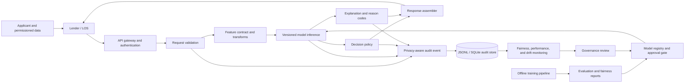
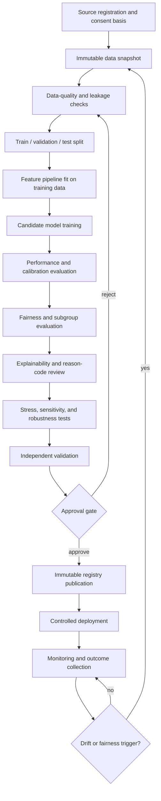

# 1. System Architecture

## 1.1 Mission and system boundary

The platform is designed to help regulated or mission-driven lenders evaluate thin-file and credit-invisible applicants using consumer-permissioned alternative data, while preserving explainability, fairness measurement, auditability, and human oversight. It has two architectural planes:

- **Offline model and governance plane:** data validation, feature transformation, training, evaluation, fairness analysis, registry publication, approval, monitoring, and retraining.
- **Online decision-support plane:** authenticated requests, schema validation, feature transformation, versioned inference, decision policy, reason codes, audit events, and monitoring-event ingestion.

The current implementation is a reference system. It does not include a production data provider, identity verification, loan-origination system, bureau integration, consent portal, appeals case-management system, or a completed approval workflow.

## 1.2 Stakeholders and actors

- **Applicant / borrower:** supplies or authorizes access to rent, utility, and cash-flow information; receives notices and explanations through the lender.
- **Lender system:** sends scoring requests and consumes score, decision recommendation, reason codes, model version, and request identifier.
- **Underwriter:** reviews borderline or exception cases and may apply documented policy overrides.
- **Compliance / fair-lending reviewer:** reviews data provenance, reason codes, subgroup metrics, thresholds, and adverse-action support.
- **Model developer:** maintains data pipelines, features, models, evaluation reports, and model cards.
- **Independent validator:** challenges data, methodology, implementation, outcomes, stability, and limitations.
- **Platform operator:** manages credentials, deployments, logging, incident response, availability, and rollback.
- **Auditor / regulator:** reconstructs what model, data contract, threshold, and reasons produced a decision.

## 1.3 Logical architecture

## 1.4 Primary online scoring sequence

1. The lender creates a unique application identifier and obtains any required consent.
2. The lender sends an API request containing the application identifier, alternative-data feature values, and optional sensitive attributes separated for monitoring.
3. Authentication and authorization controls establish the calling institution and permitted operation. The demo includes API-key-oriented scaffolding; production-grade identity and tenant authorization remain deployment work.
4. Pydantic request schemas reject malformed or unexpected fields.
5. The feature-contract layer validates ranges, missingness, names, and ordering, then transforms the payload into the model vector.
6. The serving layer loads the approved current model and registry metadata, computes a probability-like score, and applies a configured threshold.
7. The explanation layer ranks feature contributions or deterministic reason-code rules and maps them to human-readable statements.
8. The response includes application/request identifiers, score, recommendation or decision, reason codes, and model metadata.
9. The audit layer persists a privacy-minimized event. Applicant identifiers can be hashed or removed; payload keys are allowlisted.
10. Outcome events may later be ingested to calculate performance, calibration, error rates, and subgroup metrics.

## 1.5 Offline model lifecycle

The repository implements a simplified path from synthetic data to a scikit-learn logistic-regression artifact, JSON registry entry, API loading, scoring, explanation, and monitoring calculations. Independent validation, immutable storage, approval attestations, and production retraining controls are not yet complete.

## 1.6 Data architecture

### Input categories

- Rental-payment consistency, e.g. 12-month on-time rate.
- Utility-payment consistency.
- Verified cash-flow aggregates, such as average monthly income, balance, volatility, NSF events, and overdrafts.
- Stability indicators, such as months at current address.
- Sensitive or proxy attributes held separately for lawful fairness monitoring, not default prediction.
- Later performance outcomes, such as repayment or delinquency indicators.

### Data minimization

The design avoids raw transaction narratives and direct identifiers in the model feature vector. Audit defaults hash applicant identifiers and retain only allowlisted outcome, explanation, and fairness fields. Production implementations should tokenize identity upstream, separate monitoring data from inference data, encrypt at rest and in transit, define retention schedules, and record consent/provenance per source.

### Lineage identifiers

Every released model should link: source-data snapshot ID, extraction timestamp, consent basis, transform-code commit, feature-schema hash, training configuration, random seed, artifact digest, evaluation report, fairness report, validator approval, and deployment version. The current registry includes model name/version, artifact path, creation time, threshold, feature-schema hash, metrics, notes, and fairness placeholder.

## 1.7 Deployment topology

### Reference local topology

- React/Vite frontend at port 5173.
- FastAPI service at port 8000.
- Local model artifact loaded from the filesystem.
- JSON model registry and report files.
- Append-only-style JSONL and optional SQLite audit store.
- Docker and Compose definitions for repeatable packaging.

### Recommended production topology

- CDN/WAF for static UI; lender-facing traffic through an API gateway.
- OAuth2 client credentials or mutual TLS, tenant-scoped authorization, rate limits, and request-size limits.
- Stateless scoring containers across multiple availability zones.
- Signed, encrypted model artifacts in versioned object storage; approved version referenced by registry.
- Managed relational or append-only event store with encryption, retention, integrity checks, and restricted query roles.
- Separate batch environment for training and monitoring, isolated from online serving.
- Secrets manager, centralized logging, SIEM alerts, metrics/traces, backup/restore testing, and deployment rollback.
- Private network connections to approved alternative-data sources and lender systems.

## 1.8 Trust boundaries and security architecture

1. **External lender boundary:** validate caller identity, tenant, schema, freshness, and replay protection.
2. **Inference boundary:** only approved artifacts may load; verify digest/signature and feature-schema compatibility.
3. **Sensitive-monitoring boundary:** sensitive attributes require stricter role access and must not silently enter prediction.
4. **Audit boundary:** logs are security-sensitive records; prevent raw payload leakage and unauthorized modification.
5. **Training boundary:** source data and code execution can contaminate artifacts; isolate jobs, pin dependencies, scan inputs, and sign outputs.
6. **Administrative boundary:** registry promotion, threshold changes, and rollback require dual control and recorded approval.

Key threats include unauthorized access, feature/schema abuse, data exfiltration, model inversion, registry tampering, audit-log tampering, replay, denial of service, dependency compromise, and insider misuse. Current mitigations include strict schemas, configurable API-key checks, hashing/redaction, version metadata, and append-only conventions. TLS termination, WAF, robust tenant isolation, tamper-evident hash chains, artifact signing, secret rotation, and penetration testing are deployment or roadmap items.

## 1.9 Availability and failure behavior

- Fail closed when the model artifact, schema hash, or registry entry is absent or inconsistent.
- Never silently switch to an unapproved model.
- Return a correlation/request ID and non-sensitive error body.
- Route borderline scores, missing-data cases, and monitoring anomalies to manual review.
- Make audit writes durable; if policy requires synchronous audit persistence, reject scoring when the audit store is unavailable. If asynchronous, use a durable queue with back-pressure and reconciliation.
- Separate model recommendation from lender policy decision so operational policy can be reviewed independently.
- Maintain a last-known-good artifact and tested rollback runbook.

## 1.10 Architecture decisions

| Decision | Rationale | Trade-off / required control |
|---|---|---|
| Logistic regression as baseline | Interpretable, stable, common challenger/baseline | Limited nonlinear capacity; compare with constrained and ensemble candidates |
| Sensitive attributes excluded from prediction | Reduces direct discrimination risk | Fairness monitoring still needs lawful, separated collection |
| Versioned feature contract | Prevents training-serving skew | Requires strict migration and backwards-compatibility rules |
| Reason codes in response | Supports transparency and review | Codes must be accurate, specific, stable, and counsel-approved |
| JSONL/SQLite reference audit store | Simple, inspectable local implementation | Production integrity, scaling, retention, and access controls are incomplete |
| FastAPI/Pydantic | Typed API and automatic schema publication | Must add gateway, identity, tenancy, rate limits, and hardened deployment |
| Synthetic demonstration data | Reproducible and privacy-safe | Cannot establish real-world efficacy or fairness |

## 1.11 Intended-use boundaries

Permitted current use: development, education, architecture evaluation, integration prototyping, synthetic-data demonstrations, and controlled research. Prohibited current use: autonomous production lending decisions, consumer eligibility determinations, legal compliance claims, or fairness claims based solely on synthetic results.
