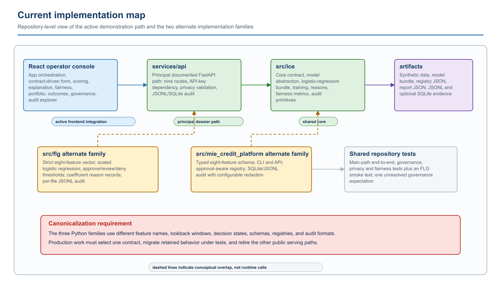
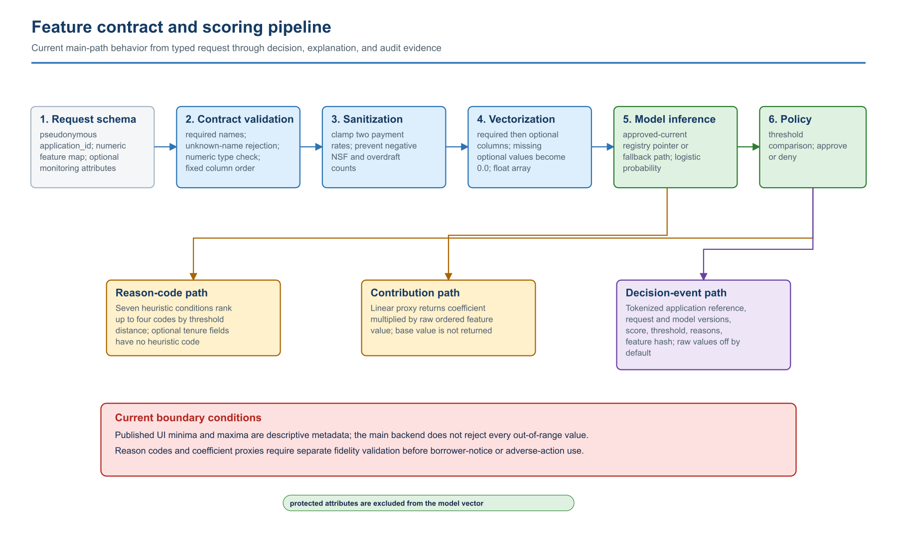
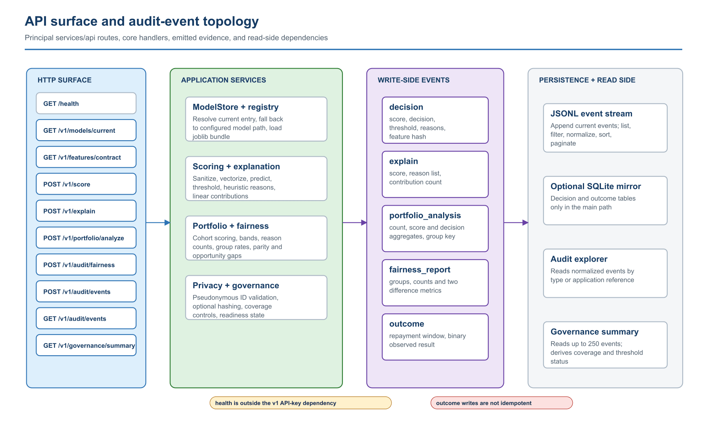
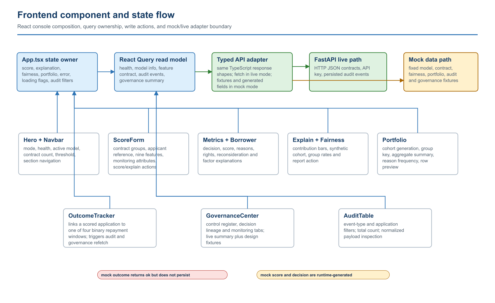
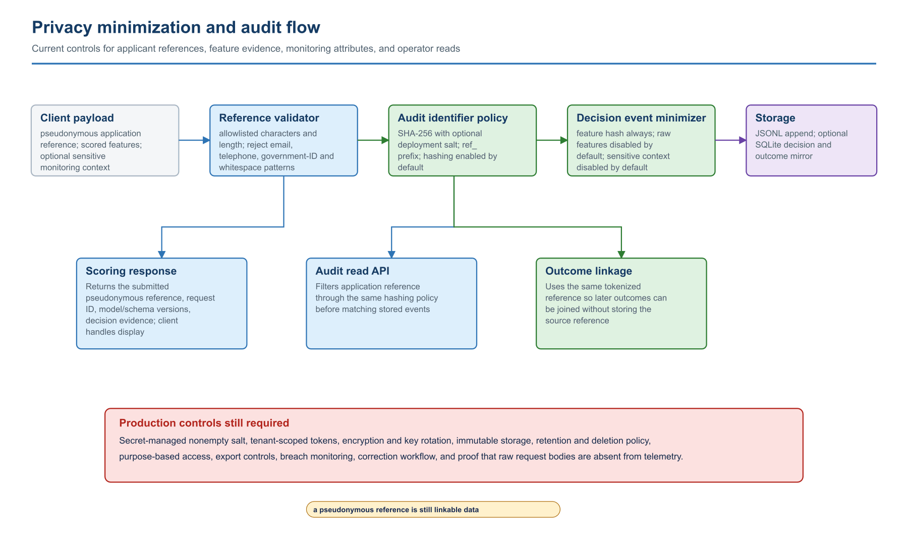
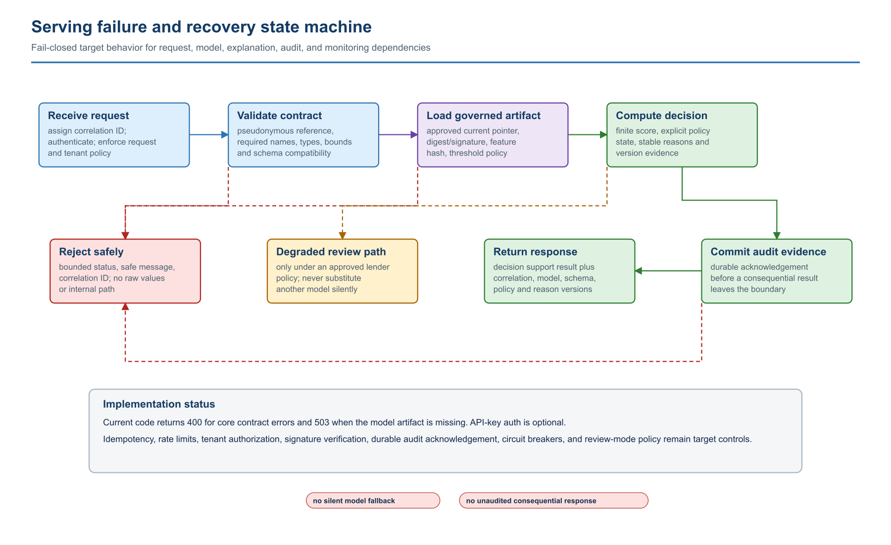

# 8. Architecture Diagram Catalog

The twelve figures answer specific engineering questions: where the lender's responsibility ends, how one scoring transaction is reconstructed, where sensitive data is separated, how a model reaches production, what happens after a fairness trigger, how the repository is divided, how features become decisions, how routes emit evidence, how the frontend manages state, and how failures recover. Some views describe the current implementation and others describe the required production design; each section states which is which. The SVG files are the editable masters; PNG copies are included for Word, email, and review systems that do not render SVG reliably.

## Architecture view 1 — System context and decision boundary

The scoring platform does not own the lender's credit policy or final action. The lender/LOS authenticates through the API edge and supplies permissioned, validated feature aggregates. The decision service applies a specific approved model and a separately versioned threshold policy. Audit and monitoring are first-class planes rather than log side effects. The model control plane can change production behavior only through a registry approval record and a signed artifact reference.

Control consequences:

**C1 — Attribute separation.** Protected or proxy attributes used for monitoring do not enter the prediction vector.

**C2 — Response evidence.** A score response is incomplete without model, policy, explanation, and request identifiers.

**C3 — Governance access.** Governance users consume aggregate evidence and alerts; they do not query raw applicant payloads by default.

**C4 — Change control.** Model promotion, threshold changes, and reason-code changes are governed releases even when application code is unchanged.

## Architecture view 2 — Online scoring transaction

The transaction is synchronous through durable audit acknowledgement. The feature contract returns both the canonical vector and the schema hash used to prove compatibility with the artifact. The explanation is computed from the same scored vector and approved model version; a cached or separately computed explanation would break fidelity. The response is assembled only after the audit layer returns an event identifier under the strict durability policy shown here.

Failure semantics:

**F1 — Caller failure.** Unknown tenant, unauthorized product, or missing endpoint scope is rejected at the edge.

**F2 — Contract failure.** Unknown fields, non-finite values, impossible ranges, and incompatible schema hashes are rejected; they are not replaced with model defaults.

**F3 — Artifact failure.** Missing or unsigned artifacts, unapproved versions, or artifact-digest mismatches make the scoring dependency unavailable.

**F4 — Audit failure.** A required audit write failure fails the transaction. A deployment that chooses asynchronous audit must use a durable queue, idempotent event key, dead-letter handling, and reconciliation control.

**F5 — Retry behavior.** Retries use the idempotency key and must reproduce the original governed result unless the caller explicitly creates a new decision transaction.

## Architecture view 3 — Reference production deployment topology

The topology separates four security zones. The edge zone terminates lender identity and request controls. The private online zone contains stateless scoring replicas and no raw data store. The evidence data zone holds the model registry, immutable audit records, and monitoring aggregates under different access roles. The offline control zone has access to governed snapshots and can publish only through the promotion workflow.

Deployment invariants:

**D1 — Artifact source.** Model artifacts are never retrieved from a public bucket or an arbitrary URL.

**D2 — Activation.** Serving verifies signature, digest, and feature compatibility before activating an artifact.

**D3 — Training isolation.** Training jobs cannot call the online scoring data plane or mutate the production registry.

**D4 — Monitoring data.** The monitoring warehouse receives tokenized outcomes and approved aggregates, not unrestricted request bodies.

**D5 — Promotion.** Promotion uses dual control, records validation and approval references, and preserves a last-known-good rollback pointer.

**D6 — Telemetry.** Operational telemetry excludes raw features and direct applicant identifiers.

## Architecture view 4 — Model lifecycle and approval gates

The lifecycle is a state machine, not a sequence of notebooks. A stage transition requires a named evidence set and an accountable approver. Rejection returns the work to the stage that owns the defect. Monitoring can force a rollback or reopen data/model development even when the deployed artifact is unchanged.

Minimum transition records:

**G1 — Data snapshot.** Source manifest, consent/permissible-purpose evidence, checksum, exclusions, label definition, and quality exceptions.

**G2 — Feature build.** Contract version, transform code commit, fitted-transform digest, leakage review, proxy review, and schema hash.

**G3 — Candidate training.** Configuration, seed, split hash, dependency image, convergence record, coefficients or parameters, and artifact digest.

**G4 — Evaluation.** Locked-set metrics, calibration, error costs, uncertainty, stress cases, and challenger comparison.

**G5 — Fairness review.** Group definitions, denominators, metrics, confidence intervals, intersectional results, mitigation trade-offs, and residual risk.

**G6 — Validation and approval.** Independent findings, issue disposition, signed decision, intended-use restrictions, threshold policy, reason dictionary, and rollback target.

## Architecture view 5 — Data lineage and evidence linkage

This view separates three data classes that are frequently collapsed in prototype systems: predictor features, sensitive monitoring attributes, and realized outcomes. They may share a tokenized join key but have different permitted purposes, access roles, retention, and release rules. The feature-schema hash flows into the artifact, registry, scoring event, and monitoring record so a reviewer can detect training-serving skew and reconstruct the decision path.

Required lineage keys:

**L1 — Source.** Provider record and manifest identifiers.

**L2 — Snapshot.** Raw-object checksum and validated-snapshot identifier.

**L3 — Split.** Training/validation/test split hash.

**L4 — Features.** Feature contract and transform versions.

**L5 — Artifact.** Model artifact digest and signature.

**L6 — Registry.** Registry version, policy version, and reason-code dictionary version.

**L7 — Decision.** Tokenized application ID and request ID.

**L8 — Outcome.** Outcome definition, maturity state, correction status, and monitoring cohort ID.

## Architecture view 6 — Fairness control loop

Fairness monitoring begins with cohort construction and data sufficiency, not a dashboard ratio. Metrics pass through an uncertainty layer before trigger evaluation. A trigger initiates root-cause analysis; it does not automatically prescribe reweighting or a threshold change. Each mitigation is evaluated against performance, calibration, stability, explanation fidelity, operational burden, and legal constraints before governance disposition.

The loop must retain:

**M1 — Cohort.** Cohort query and population definition.

**M2 — Sufficiency.** Group counts, suppression rules, missingness, provider coverage, and label maturity.

**M3 — Measurement.** Metric implementation/version, point estimates, intervals, and practical-effect thresholds.

**M4 — Trigger.** Trigger rule and breach evidence.

**M5 — Diagnosis.** Root-cause hypothesis, analyses, and rejected alternatives.

**M6 — Mitigation.** Mitigation configuration and before/after trade-off matrix.

**M7 — Disposition.** Governance disposition, accountable owner, residual risk, and rollback condition.

## Architecture view 7 — Current implementation and namespace map

This figure describes the repository as it exists, rather than the preferred target state. The principal path documented and exercised by the dossier is `frontend/` to `services/api/` to `src/ice/`, with artifacts written under `artifacts/`. Two additional Python families remain in the same repository. `src/flg/` contains a strict eight-feature scoring service with a three-state decision policy and file-based audit logger. `src/mie_credit_platform/` contains another typed model package, approval-aware registry, CLI, API surface, and configurable SQLite/JSONL audit subsystem. The dashed lines indicate shared ideas and overlapping responsibilities; they are not runtime calls between packages.

Repository implications:

**I1 — Principal path.** New documentation, frontend integration, and the main end-to-end test use `services/api` plus `src/ice` unless a section explicitly names an alternate family.

**I2 — Contract divergence.** The families disagree on identifiers (`application_id` versus `applicant_id`), feature names, lookback windows, decision states, reason formats, registry structure, and audit schemas.

**I3 — Security divergence.** The principal API provides optional API-key enforcement and pseudonymous-reference validation. The MIE family contains a deeper configurable redactor. The FLG path writes the applicant identifier and optional protected attributes into its local audit event. Those controls cannot be described as one uniform implementation.

**I4 — Canonicalization gate.** Production work must select a single public contract, copy retained behavior behind compatibility tests, migrate artifacts and evidence, remove obsolete entry points, and publish one authoritative package boundary.

**I5 — Test ownership.** The test suite currently covers both the main path and an FLG smoke path. Consolidation is incomplete until tests are reassigned to the selected canonical modules and all public examples use the same feature vocabulary.

## Architecture view 8 — Feature contract and scoring pipeline

The main scoring path treats the feature contract as the boundary between untrusted JSON and the ordered numerical vector consumed by the model. `FeatureContract.validate` requires the seven core fields, accepts the two documented optional tenure fields, rejects unknown feature names, and rejects nonnumeric values. `sanitize_features` then clamps the two payment rates and prevents negative NSF or overdraft counts. `to_model_vector` orders the required columns first and optional columns second; an omitted optional field becomes `0.0`.

That last behavior is important. Zero is a numerical value, not an explicit missingness indicator. For tenure features, it may mean no tenure or unavailable data. A production contract must choose one meaning, preserve a missingness flag where needed, and train with the same rule used online.

Current computation details:

**P1 — Probability.** `SklearnLogRegCreditModel.predict_proba` returns the positive-class probability from the serialized scikit-learn logistic-regression estimator.

**P2 — Decision.** The principal API returns `approve` when the score is at least `ICE_DECISION_THRESHOLD`; otherwise it returns `deny`. The main path does not produce `review`, although the shared result type permits that string and the FLG alternate path has an explicit review interval.

**P3 — Reasons.** Seven heuristic tests generate a ranked list of at most four reason codes. They are based on feature thresholds, not on the estimator's actual local contributions. Neither optional tenure feature has a heuristic reason code.

**P4 — Contributions.** The explanation path computes coefficient multiplied by the raw ordered feature value. It does not add the intercept, does not return the base value, and does not reconstruct a calibrated probability. The result is a lightweight directional proxy.

**P5 — Evidence.** A decision event stores the tokenized application reference, request and model identifiers, score, decision, threshold, reason codes, and a SHA-256 feature hash. Raw features and sensitive attributes are omitted under default settings.

**P6 — Validation gap.** Feature minima, maxima, steps, labels, groups, and directional hints published to the UI are metadata. Except for the four sanitization cases above, the main scoring path does not reject every value outside those published ranges.

## Architecture view 9 — API and event topology

The principal FastAPI application exposes one public health route and nine versioned operations. The `/v1` router applies the API-key dependency to every versioned route. When `ICE_API_KEY` is unset, the dependency allows the request; when configured, the caller must supply the exact `X-API-Key` value. This is demonstration authentication, not tenant authorization.

Write relationships:

**A1 — Score.** `POST /v1/score` emits a `decision` event and optionally mirrors the event into the SQLite decision table.

**A2 — Explain.** `POST /v1/explain` emits an `explain` event containing aggregate explanation evidence rather than the full contribution map.

**A3 — Portfolio.** `POST /v1/portfolio/analyze` emits a `portfolio_analysis` event containing cohort-level summary values and a flag indicating whether group analysis was available.

**A4 — Fairness.** `POST /v1/audit/fairness` emits a `fairness_report` event with group names, row count, positive label, and two difference metrics.

**A5 — Outcome.** `POST /v1/audit/events` accepts one of four binary repayment windows and emits an `outcome` event. The endpoint name is intentionally broader than its implemented behavior; it is not a generic client-controlled audit writer.

Read relationships:

**A6 — Audit explorer.** `GET /v1/audit/events` loads the JSONL file, applies optional filters, sorts by the stored creation value, normalizes event-specific fields into a `payload` object, and returns bounded pagination.

**A7 — Governance summary.** `GET /v1/governance/summary` reads up to 250 recent records and derives decision count, approval rate, explanation coverage, outcome coverage, latest fairness values, four control states, readiness, and overall status.

**A8 — Storage asymmetry.** The main SQLite mirror receives decision and outcome records only. Explain, fairness, and portfolio events remain in JSONL. The read endpoints also use JSONL. SQLite is therefore not a complete alternate read model in the principal path.

## Architecture view 10 — Frontend state and interaction flow

`App.tsx` is the client-side composition root. It owns the most recent score, explanation, fairness report, portfolio analysis, error message, action-level loading flags, and audit filters. React Query owns read-side server state: health, model metadata, feature contract, audit events, and governance summary. The typed adapter in `frontend/src/lib/api.ts` selects live HTTP calls only when `VITE_API_BASE_URL` is defined, nonempty, and not equal to `mock`.

Component relationships:

**U1 — Navbar and Hero.** Show execution mode, navigation, service status, model identity, contract size, threshold, and feature-group count.

**U2 — ProgramRoadmap.** Presents the two objectives and nine implementation phases as design and planning content. It is static frontend data, not a deployment tracker.

**U3 — ScoreForm.** Builds controls from the active feature contract, separates scored fields from monitoring attributes, and submits score or explanation requests.

**U4 — MetricsGrid and BorrowerTransparency.** Present the most recent decision, score, threshold, reason codes, group fairness snapshot, factor descriptions, rights, and reconsideration text.

**U5 — ExplainabilityPanel and FairnessPanel.** Present contribution direction and magnitude and run a synthetic group batch through the fairness adapter.

**U6 — PortfolioWorkbench.** Creates a synthetic cohort, selects a monitoring group key, submits a portfolio request, and displays aggregates, reason frequency, group metrics, and row previews.

**U7 — OutcomeTracker.** Links an application to a binary observed repayment result. On success, `App.tsx` refetches audit events and the governance summary.

**U8 — GovernanceCenter.** Combines live or mock coverage controls with static design fixtures for the control register, data lineage, and monitoring signals.

**U9 — AuditTable.** Filters normalized events by event type and application reference and renders the payload as formatted JSON.

The mock adapter uses the same TypeScript shapes, but it is not a behavioral replica. It returns fixtures for most reads, generates score/decision/request/time fields for scoring, and returns success without persistence for outcomes.

## Architecture view 11 — Privacy and audit data flow

The main API accepts a pseudonymous application reference rather than a direct personal identifier. The validator restricts length and characters and rejects values matching common email, telephone, and government-ID patterns. The validator is a guardrail, not a general detector: an allowlisted-looking token can still be personally identifying if the caller chooses it poorly.

With `ICE_HASH_AUDIT_IDENTIFIERS=true`, the application reference is transformed into `ref_` plus a SHA-256 digest before audit persistence. An optional deployment salt can be applied. The same function is used for decision, explanation, outcome, and application-filter queries, allowing a stable audit join without persisting the submitted reference. Because the token remains linkable, it is pseudonymous data and still requires access and retention controls.

Minimization rules:

**R1 — Raw features.** `ICE_LOG_RAW_FEATURES` defaults to false. The decision event stores a hash of the sanitized feature dictionary instead.

**R2 — Sensitive context.** `ICE_STORE_SENSITIVE_FOR_MONITORING` defaults to false. When enabled, the current main event object can include the supplied monitoring attributes; a real deployment should send them to a separately controlled store rather than a general decision log.

**R3 — Application reference.** Hashing defaults to true, but an empty salt still permits cross-record linkage and may be vulnerable to guessing if caller identifiers have a small search space.

**R4 — Response.** The response returns the submitted pseudonymous reference because the UI and lender need transaction continuity. Transport logs, browser telemetry, and reverse proxies must be configured not to capture it unnecessarily.

**R5 — Production gap.** The reference storage is append-oriented but not cryptographically sealed, immutable, tenant-isolated, or governed by implemented retention and correction workflows.

## Architecture view 12 — Failure and recovery state machine

This figure distinguishes implemented checks from target production semantics. The current principal path returns a client error for contract failures and a service-unavailable error when the configured model file cannot be loaded. It optionally enforces one API key. It writes audit evidence synchronously to a local JSONL file but does not receive a separate durable acknowledgement from an external evidence service.

Target invariants:

**S1 — No silent substitution.** An unavailable, unapproved, incompatible, or corrupted artifact must not be replaced with another model unless a separately governed last-known-good policy explicitly authorizes that state transition.

**S2 — No partial decision.** The platform must not return a consequential result when required model, policy, explanation, or audit evidence cannot be bound to the same transaction.

**S3 — Review is a policy state.** A degraded human-review path may be safer than denial or approval, but it must be defined by lender policy, exposed in the response contract, monitored, and tested. It must not be invented by exception handling.

**S4 — Safe errors.** Error responses include a correlation identifier and bounded public message without feature values, model paths, stack traces, credentials, or tenant details.

**S5 — Retry discipline.** Score and outcome writes require an idempotency key or equivalent event key. The current outcome endpoint can append duplicates if a client retries after an ambiguous network failure.

**S6 — Recovery evidence.** Circuit-breaker state, rollback choice, queue reconciliation, operator action, affected transactions, and final disposition belong in the incident record.
