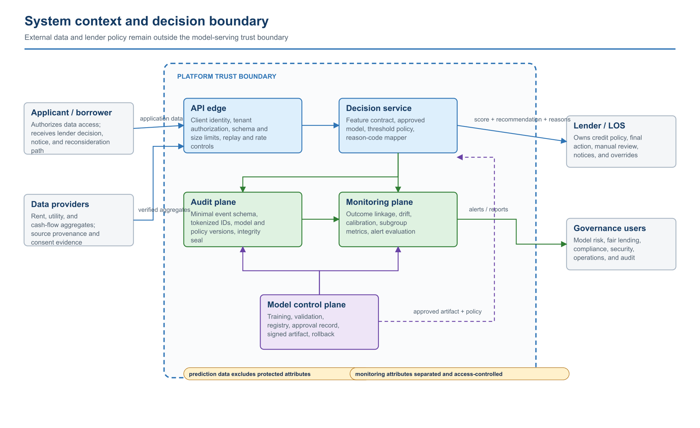
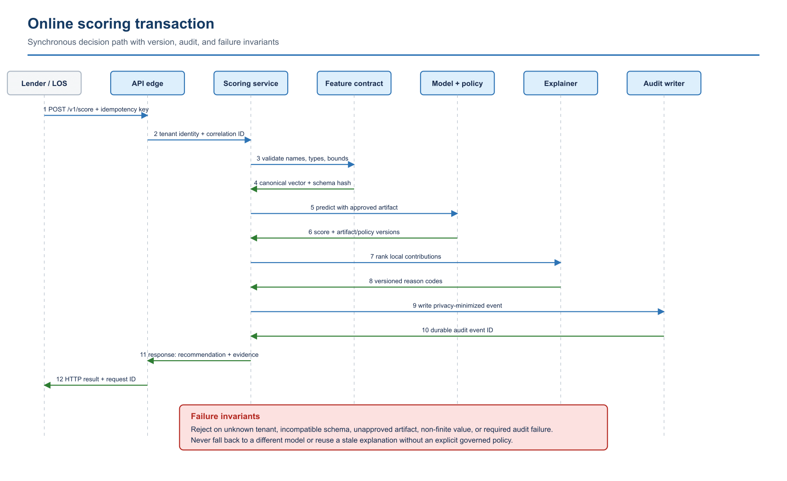
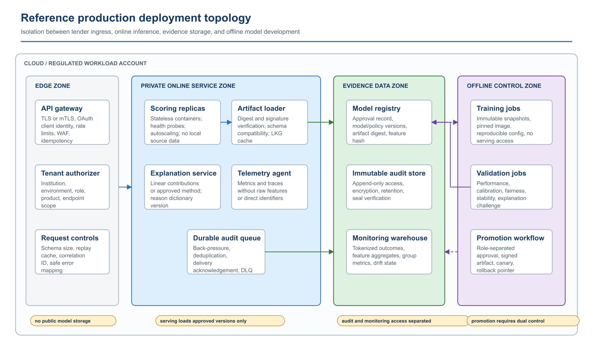
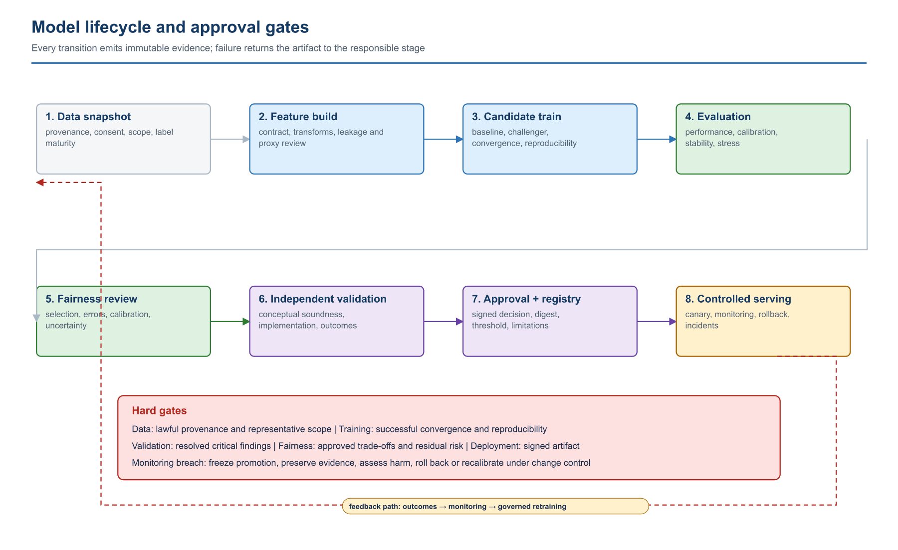
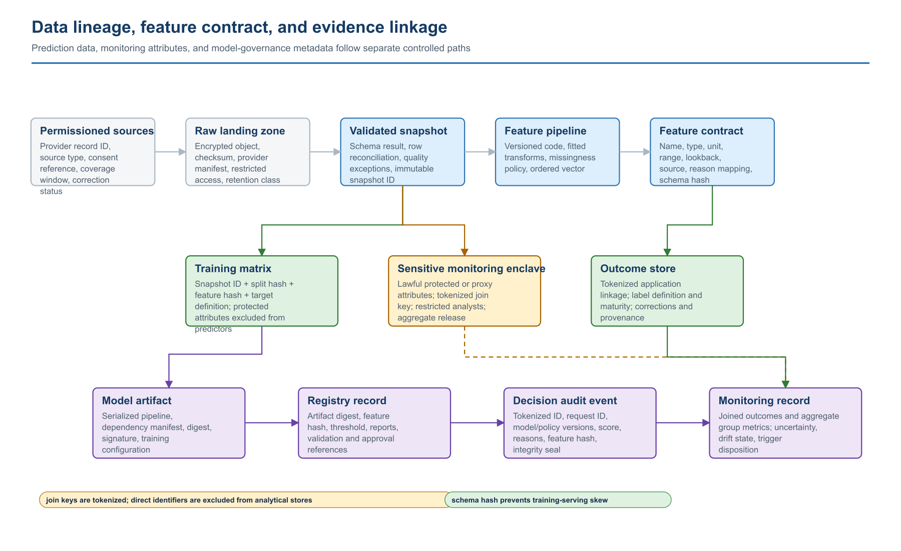
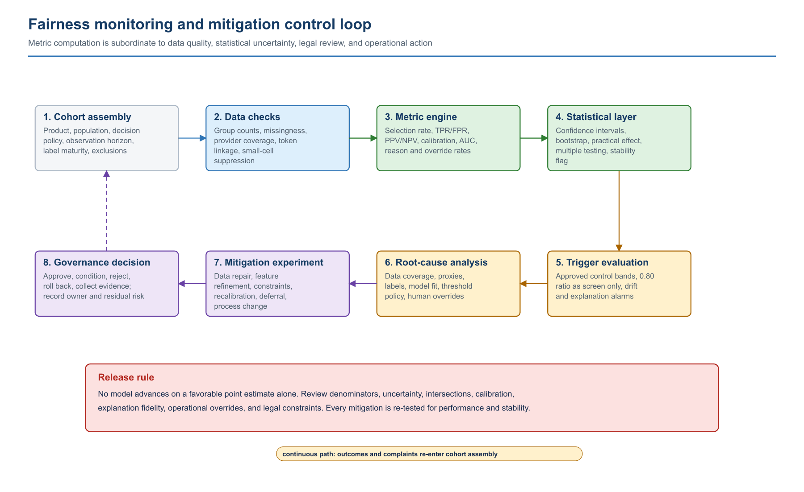

# 8. Architecture Diagram Catalog

The figures in this section are normative design views. They are not marketing illustrations. Each figure identifies a system boundary, a control hand-off, or an evidence relationship that must be implemented and tested. The SVG files are the editable masters; PNG copies are provided for Word, email, and review systems that do not render SVG reliably.

## Architecture view 1 — System context and decision boundary

The scoring platform does not own the lender's credit policy or final action. The lender/LOS authenticates through the API edge and supplies permissioned, validated feature aggregates. The decision service applies a specific approved model and a separately versioned threshold policy. Audit and monitoring are first-class planes rather than log side effects. The model control plane can change production behavior only through a registry approval record and a signed artifact reference.

Control consequences:

**C1 — Attribute separation.** Protected or proxy attributes used for monitoring do not enter the prediction vector.

**C2 — Response evidence.** A score response is incomplete without model, policy, explanation, and request identifiers.

**C3 — Governance access.** Governance users consume aggregate evidence and alerts; they do not query raw applicant payloads by default.

**C4 — Change control.** Model promotion, threshold changes, and reason-code changes are governed releases even when application code is unchanged.

## Architecture view 2 — Online scoring transaction

The transaction is synchronous through durable audit acknowledgement. The feature contract returns both the canonical vector and the schema hash used to prove compatibility with the artifact. The explanation is computed from the same scored vector and approved model version; a cached or separately computed explanation would break fidelity. The response is assembled only after the audit layer returns an event identifier under the strict durability policy shown here.

Failure semantics:

**F1 — Caller failure.** Unknown tenant, unauthorized product, or missing endpoint scope is rejected at the edge.

**F2 — Contract failure.** Unknown fields, non-finite values, impossible ranges, and incompatible schema hashes are rejected; they are not replaced with model defaults.

**F3 — Artifact failure.** Missing or unsigned artifacts, unapproved versions, or artifact-digest mismatches make the scoring dependency unavailable.

**F4 — Audit failure.** A required audit write failure fails the transaction. A deployment that chooses asynchronous audit must use a durable queue, idempotent event key, dead-letter handling, and reconciliation control.

**F5 — Retry behavior.** Retries use the idempotency key and must reproduce the original governed result unless the caller explicitly creates a new decision transaction.

## Architecture view 3 — Reference production deployment topology

The topology separates four security zones. The edge zone terminates lender identity and request controls. The private online zone contains stateless scoring replicas and no raw data store. The evidence data zone holds the model registry, immutable audit records, and monitoring aggregates under different access roles. The offline control zone has access to governed snapshots and can publish only through the promotion workflow.

Deployment invariants:

**D1 — Artifact source.** Model artifacts are never retrieved from a public bucket or an arbitrary URL.

**D2 — Activation.** Serving verifies signature, digest, and feature compatibility before activating an artifact.

**D3 — Training isolation.** Training jobs cannot call the online scoring data plane or mutate the production registry.

**D4 — Monitoring data.** The monitoring warehouse receives tokenized outcomes and approved aggregates, not unrestricted request bodies.

**D5 — Promotion.** Promotion uses dual control, records validation and approval references, and preserves a last-known-good rollback pointer.

**D6 — Telemetry.** Operational telemetry excludes raw features and direct applicant identifiers.

## Architecture view 4 — Model lifecycle and approval gates

The lifecycle is a state machine, not a sequence of notebooks. A stage transition requires a named evidence set and an accountable approver. Rejection returns the work to the stage that owns the defect. Monitoring can force a rollback or reopen data/model development even when the deployed artifact is unchanged.

Minimum transition records:

**G1 — Data snapshot.** Source manifest, consent/permissible-purpose evidence, checksum, exclusions, label definition, and quality exceptions.

**G2 — Feature build.** Contract version, transform code commit, fitted-transform digest, leakage review, proxy review, and schema hash.

**G3 — Candidate training.** Configuration, seed, split hash, dependency image, convergence record, coefficients or parameters, and artifact digest.

**G4 — Evaluation.** Locked-set metrics, calibration, error costs, uncertainty, stress cases, and challenger comparison.

**G5 — Fairness review.** Group definitions, denominators, metrics, confidence intervals, intersectional results, mitigation trade-offs, and residual risk.

**G6 — Validation and approval.** Independent findings, issue disposition, signed decision, intended-use restrictions, threshold policy, reason dictionary, and rollback target.

## Architecture view 5 — Data lineage and evidence linkage

This view separates three data classes that are frequently collapsed in prototype systems: predictor features, sensitive monitoring attributes, and realized outcomes. They may share a tokenized join key but have different permitted purposes, access roles, retention, and release rules. The feature-schema hash flows into the artifact, registry, scoring event, and monitoring record so a reviewer can detect training-serving skew and reconstruct the decision path.

Required lineage keys:

**L1 — Source.** Provider record and manifest identifiers.

**L2 — Snapshot.** Raw-object checksum and validated-snapshot identifier.

**L3 — Split.** Training/validation/test split hash.

**L4 — Features.** Feature contract and transform versions.

**L5 — Artifact.** Model artifact digest and signature.

**L6 — Registry.** Registry version, policy version, and reason-code dictionary version.

**L7 — Decision.** Tokenized application ID and request ID.

**L8 — Outcome.** Outcome definition, maturity state, correction status, and monitoring cohort ID.

## Architecture view 6 — Fairness control loop

Fairness monitoring begins with cohort construction and data sufficiency, not a dashboard ratio. Metrics pass through an uncertainty layer before trigger evaluation. A trigger initiates root-cause analysis; it does not automatically prescribe reweighting or a threshold change. Each mitigation is evaluated against performance, calibration, stability, explanation fidelity, operational burden, and legal constraints before governance disposition.

The loop must retain:

**M1 — Cohort.** Cohort query and population definition.

**M2 — Sufficiency.** Group counts, suppression rules, missingness, provider coverage, and label maturity.

**M3 — Measurement.** Metric implementation/version, point estimates, intervals, and practical-effect thresholds.

**M4 — Trigger.** Trigger rule and breach evidence.

**M5 — Diagnosis.** Root-cause hypothesis, analyses, and rejected alternatives.

**M6 — Mitigation.** Mitigation configuration and before/after trade-off matrix.

**M7 — Disposition.** Governance disposition, accountable owner, residual risk, and rollback condition.
