# 9. Product Demonstration and Operator Walkthrough

This section documents the working React demonstration console included in `frontend/`. The screens below were captured from the repository's locally running application in mock mode. They show implemented interaction paths and presentation behavior; they do not represent a production lending deployment or the use of real applicant records.

## Demonstration environment

The console is a Vite and React application backed by a typed API client. When `VITE_API_BASE_URL` is not configured, the client selects the repository's deterministic mock adapter. Mock mode exercises the same TypeScript request and response shapes used by the live FastAPI integration, which makes it suitable for interface review, workflow demonstrations, and document evidence without transmitting applicant information.

```text
cd frontend
npm install
npm run dev
```

The navigation bar displays the active execution mode. Before interpreting a result, an operator should confirm the API status, model version, feature-contract count, and decision threshold shown in the status cards.

| Visible control | Operator check | System source |
|---|---|---|
| Mode badge | Confirm `mock` for demonstrations or `live` for an approved API environment | `USE_API` selection in `frontend/src/lib/api.ts` |
| API status | Confirm the service is available before submitting a request | Health-query result |
| Active model | Record the model version associated with the decision | Model metadata endpoint or mock adapter |
| Feature contract | Confirm the number of active scored inputs | Feature-contract response |
| Decision threshold | Confirm the approval boundary used for the session | Active feature contract |

## Demonstration screen 1 — Product entry point and runtime status

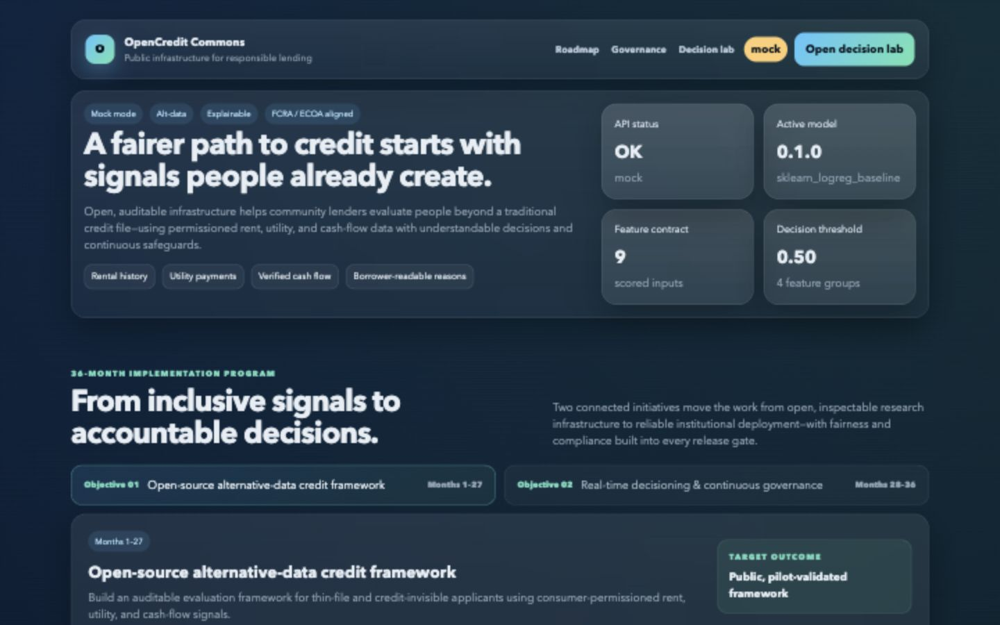

The landing view gives the operator a fast integrity check before any scoring action. The four status cards are not decorative metrics: together they identify the service state, model artifact, input contract, and threshold that govern downstream decisions. The `Open decision lab` action moves directly to the contract-driven scoring workbench.

Operator procedure:

1. Verify the mode badge in the navigation bar.
2. Confirm the API status reads `OK`.
3. Record the active model version and feature-contract count.
4. Confirm the displayed threshold matches the approved operating configuration.
5. Select `Open decision lab` to begin a demonstration request.

## Demonstration screen 2 — Contract-driven applicant input

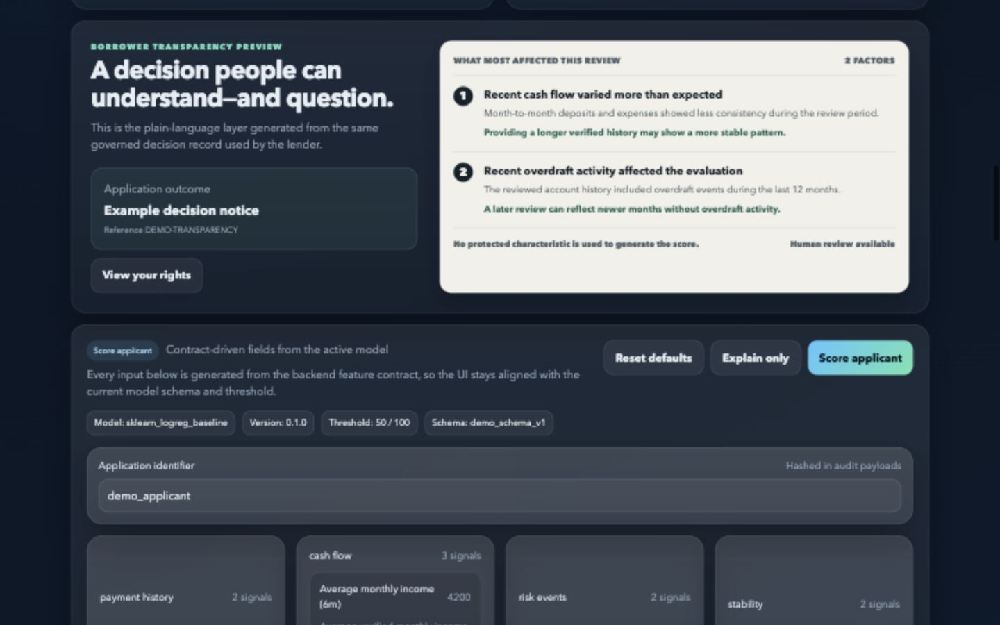

The decision workbench is generated from the active feature contract instead of a separately maintained list of form fields. Each definition supplies the field name, label, description, minimum, maximum, step size, default value, requirement flag, and directional interpretation. This prevents silent drift between the browser form and the scoring schema.

The input workflow separates three data classes:

- `application_id` identifies the request in the user workflow; the audit layer stores a hashed representation rather than the direct identifier.
- `features` contains scored alternative-data signals such as payment history, verified cash flow, risk events, and stability indicators.
- `sensitive_attributes` is optional monitoring context. It is passed to authorized fairness-monitoring paths and is not used to calculate the applicant score.

Operator procedure:

1. Confirm the model, version, threshold, and schema chips above the form.
2. Enter a non-sensitive application reference for a demonstration.
3. Review each contract-generated feature value and its allowed range.
4. Use `Explain only` when validating contribution behavior without treating the response as a final decision.
5. Use `Score applicant` to submit the complete typed payload.
6. Use `Reset defaults` before starting a separate demonstration scenario.

## Demonstration screen 3 — Scored decision and borrower-readable output

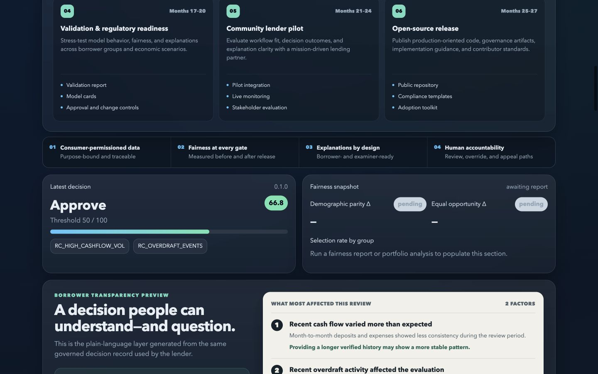

The result panel keeps the numerical score, decision threshold, decision label, model version, and reason codes in one visual record. The adjoining borrower-transparency view translates stable reason codes into plain-language factors and suggested next steps. The interface also states that protected characteristics are not used to generate the score and exposes a human-review path.

Interpretation rules:

- The numerical score is evaluated against the displayed threshold; the decision label should never be interpreted without both values.
- Reason codes are derived from governed feature contributions and must remain stable across API, audit, and notice-generation layers.
- Borrower-facing language is an explanation surface, not a substitute for jurisdiction-specific adverse-action review.
- A demonstration approval is synthetic evidence of interface behavior, not an underwriting recommendation.

## Demonstration screen 4 — Explanation and subgroup fairness review

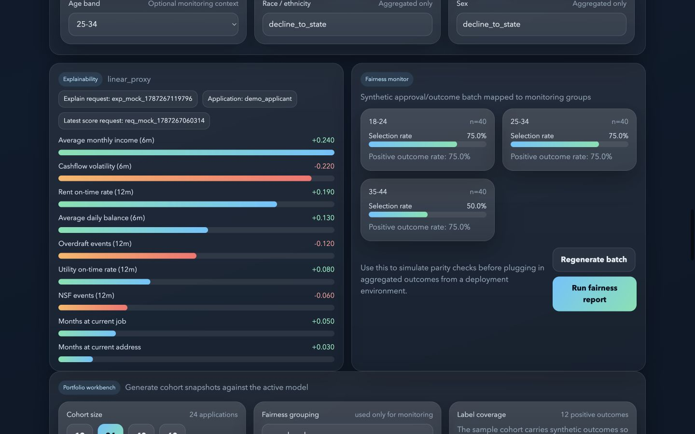

The explanation panel ranks feature contributions by absolute magnitude. Positive bars increase the model output relative to the local baseline; negative bars reduce it. The panel binds the explanation request to the application reference and the latest score request so an auditor can reconcile the views.

The fairness monitor operates on a synthetic batch with protected-group labels, predicted outcomes, and observed labels. Selecting `Run fairness report` calculates demographic-parity and equal-opportunity differences and returns group-level selection rates and counts. The batch generator is intentionally visible so reviewers do not mistake the demonstration values for deployment evidence.

Review sequence:

1. Run `Explain only` and confirm that all expected feature contributions are returned.
2. Check the sign and relative magnitude of the leading contributions against the submitted feature values.
3. Inspect the group sample size before interpreting a rate.
4. Run the fairness report and compare the parity metrics with the documented review thresholds.
5. Investigate any group with low support, unstable rates, or a threshold breach before model promotion.

## Demonstration screen 5 — Portfolio analysis workbench

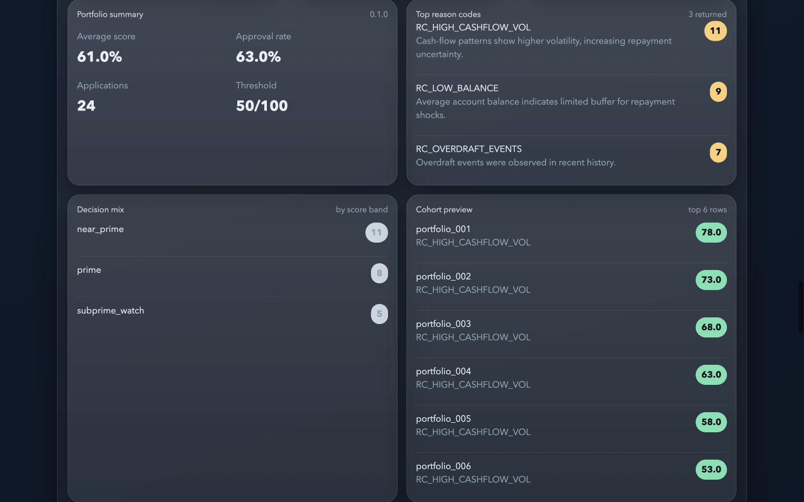

The portfolio workbench evaluates a cohort against one model contract and one threshold. The operator can choose the demonstration cohort size and the protected attribute used only for aggregated monitoring. Results combine decision statistics, reason-code frequency, score-band distribution, and a small row-level preview.

The portfolio summary is intended for operational review rather than individual adjudication. A high-frequency reason code may indicate a cohort characteristic, a feature-quality problem, a data-source shift, or a threshold interaction. It should trigger analysis against lineage and data-quality evidence before any policy change.

## Demonstration screen 6 — Governance lineage and audit evidence

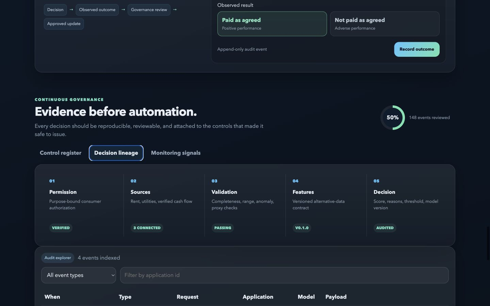

The governance center exposes the evidence chain used to reproduce a decision: permission, source connection, validation, versioned features, and the final scored decision. Adjacent controls connect the decision to observed repayment outcomes and governed model updates. The audit explorer filters append-only events by type and application reference without requiring direct personal identifiers in the display.

An operator reviewing a questioned decision should follow the lineage from right to left:

1. Identify the decision event and model version.
2. Resolve the feature-schema version used by that model.
3. Confirm validation status for the submitted feature set.
4. Trace each feature to its connected source and transformation.
5. Confirm the applicable consumer permission and permissible-purpose evidence.
6. Preserve the request, explanation, outcome, and governance events as one review package.

## Demonstration screen 7 — Complete alternative-data feature contract

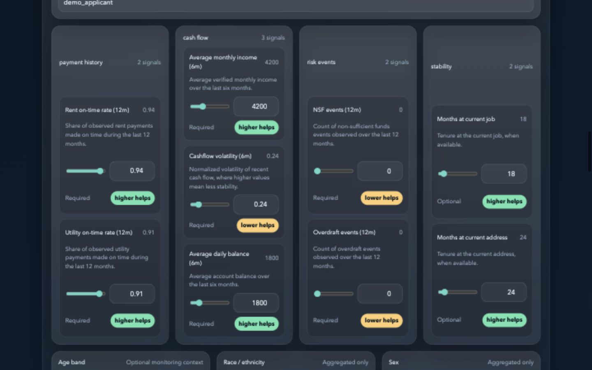

The expanded input grid makes the feature contract inspectable at the point of use. Each card shows the human-readable definition, current value, permitted control range, whether the signal is required, and the expected monotonic direction. The four groups correspond to separate engineering and review concerns:

- Payment history represents observed rent and utility performance over a defined lookback period.
- Cash flow represents verified income, balance, and volatility aggregates rather than raw transaction narratives.
- Risk events represent bounded counts such as NSF and overdraft events.
- Stability represents optional tenure indicators that require separate proxy-risk and necessity review.

The monitoring attributes beneath the scored grid are visually separated from prediction inputs. A production implementation must preserve that separation in the API schema, feature transformer, model vector, logs, and access-control policy.

## Demonstration screen 8 — Borrower rights and reconsideration path

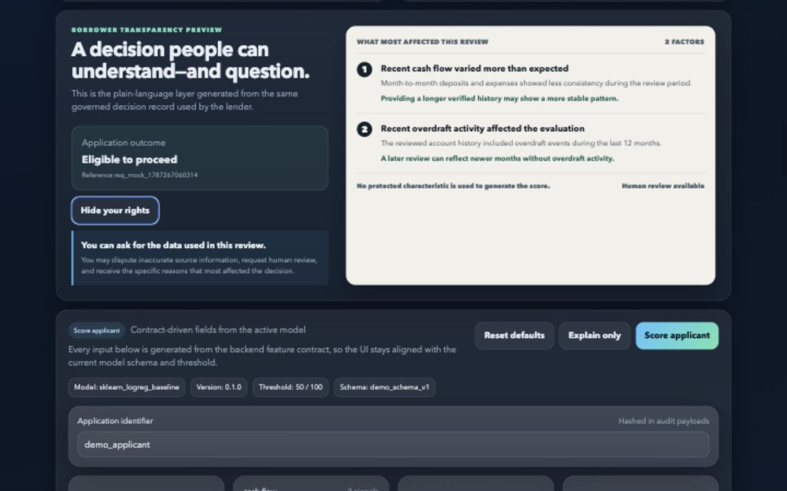

Selecting `View your rights` expands the reconsideration notice without leaving the decision context. The notice states that the borrower can request the data used in the review, dispute inaccurate source information, obtain the specific reasons that most affected the decision, and request human review. The interface is intentionally explicit that this is a demonstration notice; production language requires counsel approval, lender policy integration, delivery evidence, and jurisdiction-specific testing.

## Demonstration screen 9 — Populated decision and fairness summary

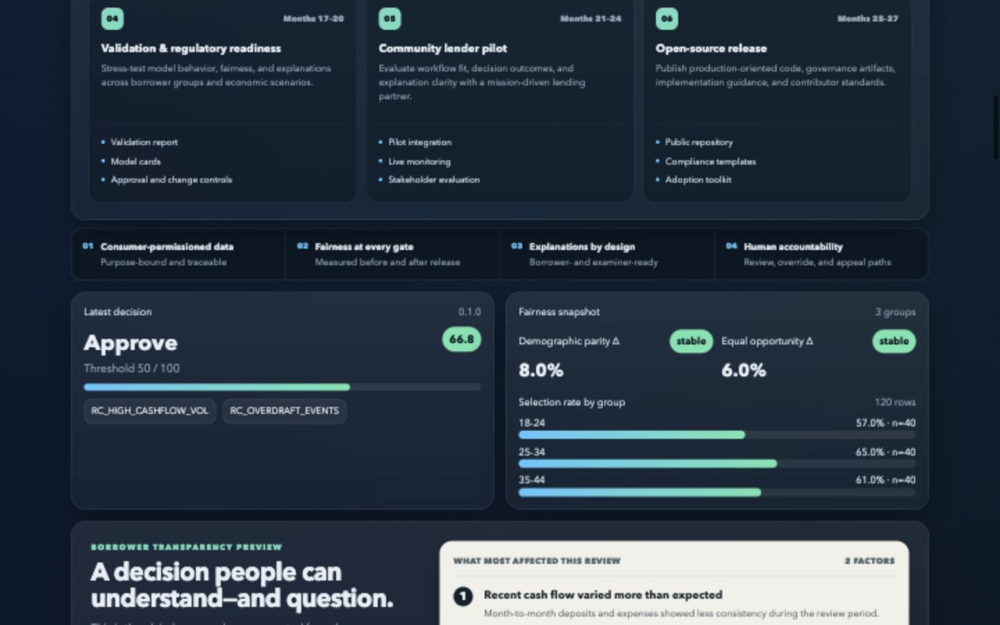

This view joins an individual model result with a separately calculated cohort-monitoring snapshot. The pairing is useful for reviewers, but the data paths must remain distinct: an applicant's protected attributes do not enter the score, while aggregated protected-group labels are required to evaluate selection and outcome differences. The interface includes group counts alongside rates because a parity value without denominator context is not reviewable evidence.

## Demonstration screen 10 — Observed-outcome feedback

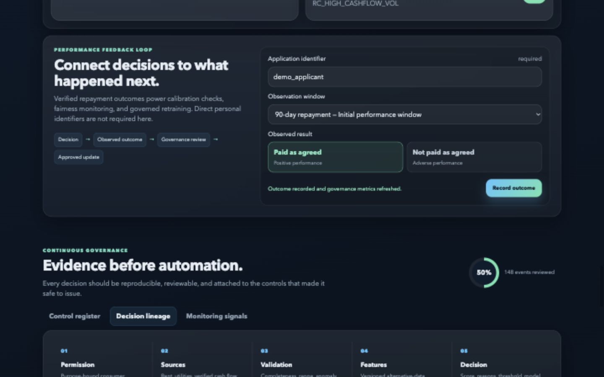

The outcome workflow connects a prior decision to later verified performance. The operator selects a governed observation window and records a binary result. The mock adapter returns confirmation that the outcome event was recorded and governance metrics were refreshed. In production, the same action requires source provenance, correction handling, late-arriving-event policy, access controls, retention rules, and an immutable link to the original decision event.

## Demonstration screen 11 — Continuous monitoring signals

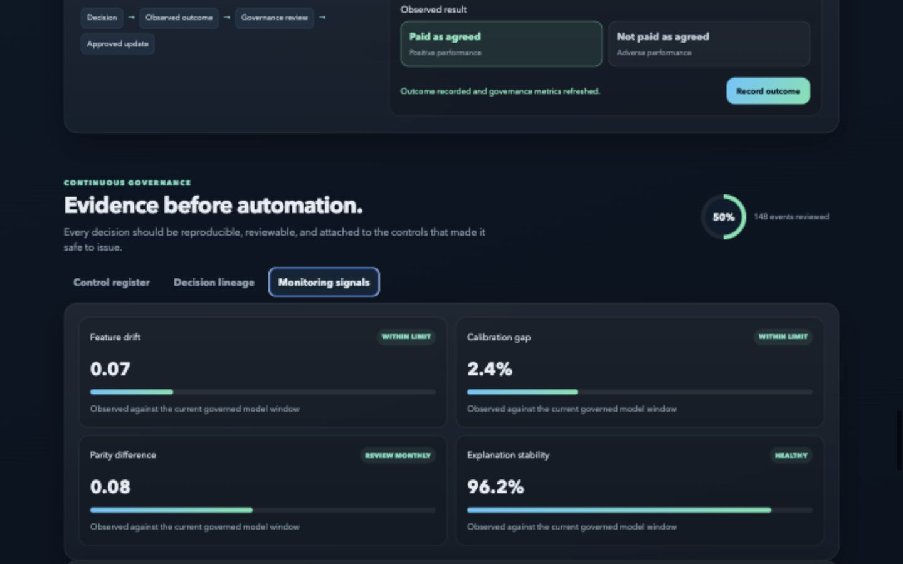

The monitoring tab presents four different control families rather than collapsing them into a single health score. Feature drift tests input-distribution change, calibration gap tests the relationship between predicted and observed outcomes, parity difference tests subgroup selection behavior, and explanation stability tests whether contribution patterns change unexpectedly. Each signal needs its own population window, baseline, threshold, severity, owner, and escalation runbook.

## Demonstration screen 12 — Governance control register

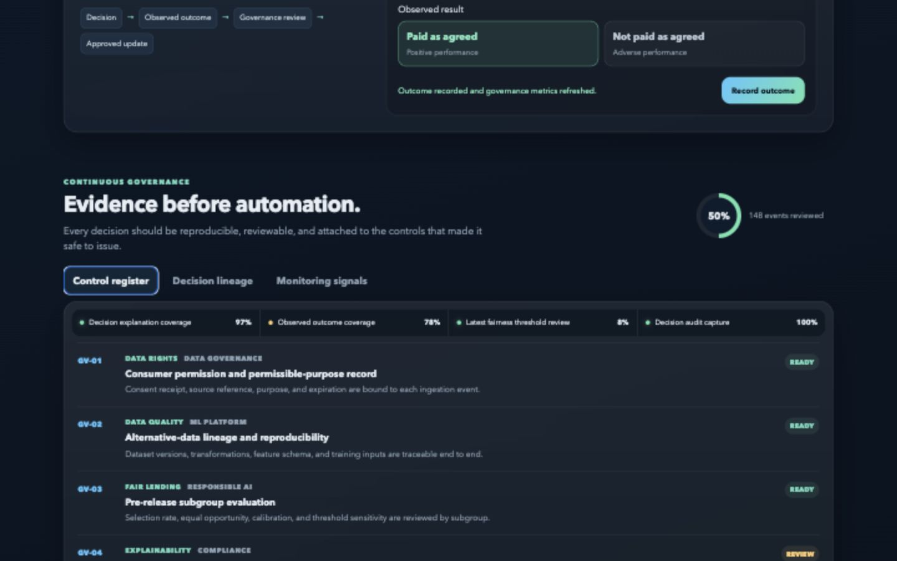

The control register binds operating evidence to named governance controls. The header strip summarizes explanation coverage, observed-outcome coverage, fairness review, and audit capture. Control rows identify the domain, accountable function, required evidence, and current readiness state. A production register should replace fixture values with queryable evidence identifiers and should require recorded approval before a control can change from review or planned to ready.

## End-to-end demonstration script

1. Start the frontend and confirm the `mock` mode badge.
2. Record the status-card values shown on the landing screen.
3. Open the decision lab and retain the default synthetic feature values.
4. Submit `Score applicant` and reconcile the score with the visible threshold.
5. Review the returned reason codes and borrower-readable factors.
6. Submit `Explain only` and compare contribution direction with the feature definitions.
7. Run the synthetic fairness report and inspect group counts before rate differences.
8. Run the portfolio analysis and examine leading reason-code concentration.
9. Open `Governance`, select `Decision lineage`, and trace the evidence stages.
10. Use the audit explorer to confirm that the decision, explanation, fairness, and portfolio events are indexed.

## Demonstration limitations

- The screenshots use deterministic mock responses and synthetic applicant features.
- No production data source, consumer-permission service, lender identity system, or adverse-action delivery channel is connected.
- Displayed model metrics are demonstration fixtures unless independently reconciled with the evidence appendices.
- Regulatory alignment labels describe the control design intent; they do not constitute legal approval or production certification.
- The interface is evidence of implemented product behavior, while production readiness still depends on security review, independent validation, accessibility testing, and deployment-specific compliance approval.
